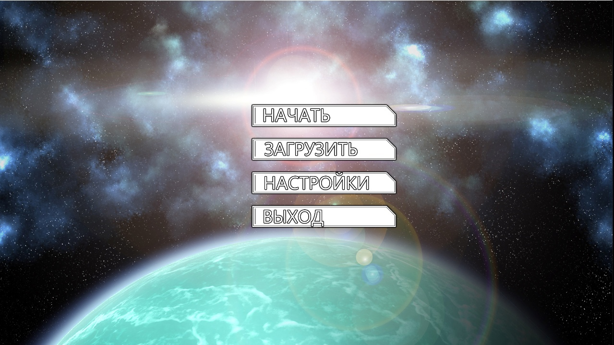
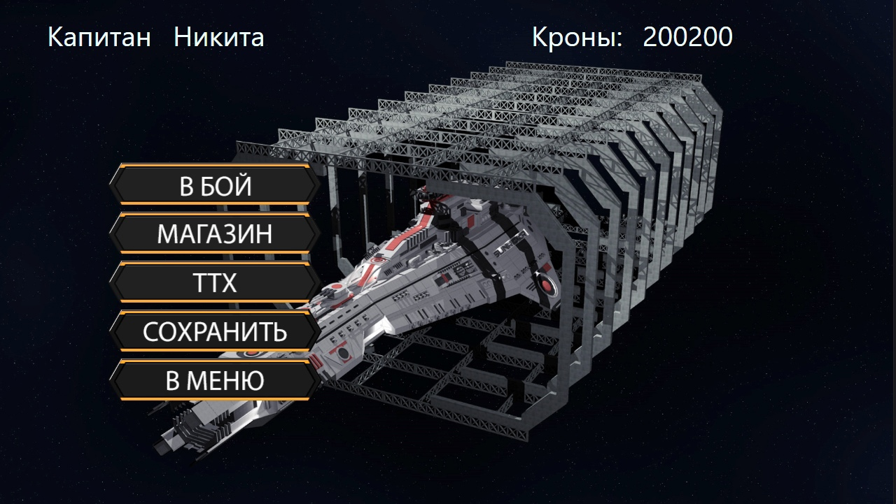
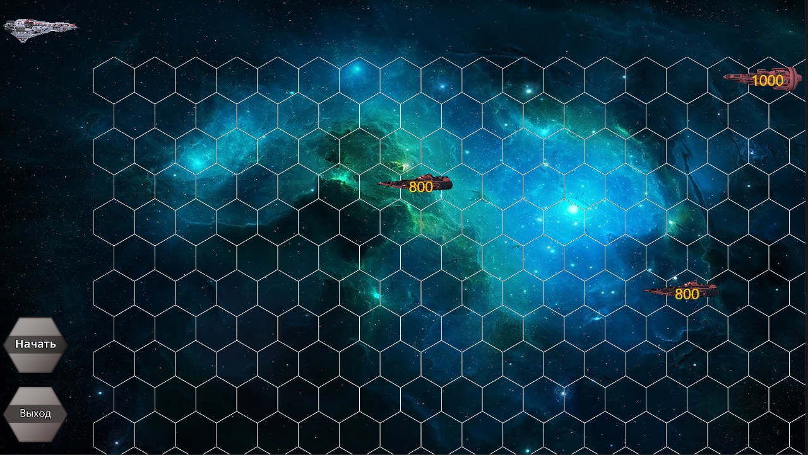

# SpaceBattleShip

Данный проект является первым крупным проектом в университете, который я сделал в одиночку. Он представляет из себя пошаговую стратегию. 
Написал проект на C# с использованием WPF в качестве курсовой работы на 2 курсе. Игровые движки не использовались, тогда я хотел более тщательно разобраться в самом языке.

В репозитории можно найти папку GameExe. В ней находится необходимый exe-файл для запуска игры. Игра предоставляет возможность сохранения, загрузки, выбор врагов, прокачка своего космического корабля.
В роли особенной фичи выступало голосовое управление, но она не сохранилась, ибо полетела Windows до сохранения проекта в другое хранилище(

Стоит отметить, что весь код написал на одной странице, но так было задуманно ради нормальных переходов между окнами.

​
​
​
